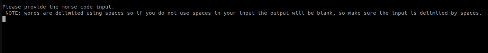
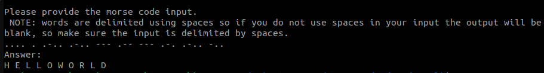

# morse-code-decoder-cli

A simple cli tool to decode morse code built with nodejs

### How to use this tool?

1. Clone this repository
1. Install dependencies
   ```bash
   npm install
   ```
1. Run the program
   ```bash
   npm start
   ```
1. Once you get the output as shown in below screenshot provide the input in morse code as hit enter
   

1. The tool spits out the output and exits.
   
